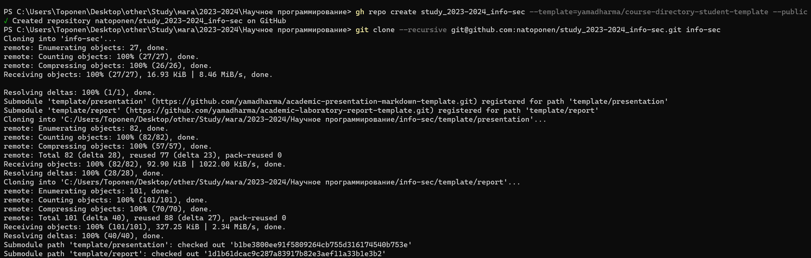
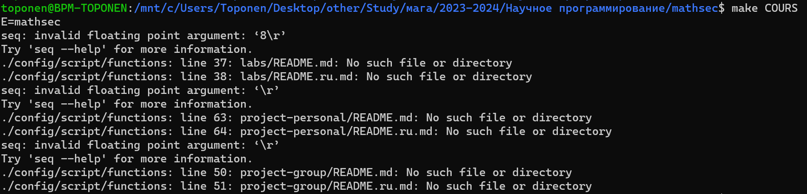

---
## Front matter
lang: ru-RU
title: Лабораторная работа №1
subtitle: Системы контроля версий
author:
  - Топонен Н. А.
institute:
  - Российский университет дружбы народов, Москва, Россия
date: 19 сентября 2023

## i18n babel
babel-lang: russian
babel-otherlangs: english

## Formatting pdf
toc: false
toc-title: Содержание
slide_level: 2
aspectratio: 169
section-titles: true
theme: metropolis
header-includes:
 - \metroset{progressbar=frametitle,sectionpage=progressbar,numbering=fraction}
 - '\makeatletter'
 - '\beamer@ignorenonframefalse'
 - '\makeatother'
---

# Информация

## Докладчик

:::::::::::::: {.columns align=center}
::: {.column width="70%"}

  * Топонен Никита Андреевич
  * студент Российского университет дружбы народов
  * [1132236933@rudn.ru](mailto:1132236933@rudn.ru)
  * <https://github.com/natoponen>

:::
::: {.column width="30%"}

:::
::::::::::::::

# Вводная часть

## Цель работы

- Изучить идеологию и применение средств контроля версий.
- Освоить умения по работе с git.

## Задание

- Создать базовую конфигурацию для работы с git.
- Создать ключ SSH.
- Создать ключ PGP.
- Настроить подписи git.
- Зарегистрироваться на Github.
- Создать локальный каталог для выполнения заданий по предмету.

# Теоретическое введение

- Системы контроля версий (Version Control System, VCS).
- Обычно основное дерево проекта хранится в локальном или удалённом репозитории.
- При внесении изменений в содержание проекта система контроля версий позволяет их фиксировать.
- Git представляет собой набор программ командной строки.
- Git является распределённой системой контроля версий

# Выполнение лабораторной работы

## Профиль на github

{width=70%}

## SHH ключ

## Утилита gh

## Создание репозитория с помощью gh

## Создание репозитория с помощью gh

## Отправка в удаленный репозиторий

## Отправка в удаленный репозиторий

{width=50%}

## Выводы

- Познакомился с системой контроля версий git.
- Создал репозиторий курса с помощью утилиты gh.
- Отправил данные в удаленный репозиторий.