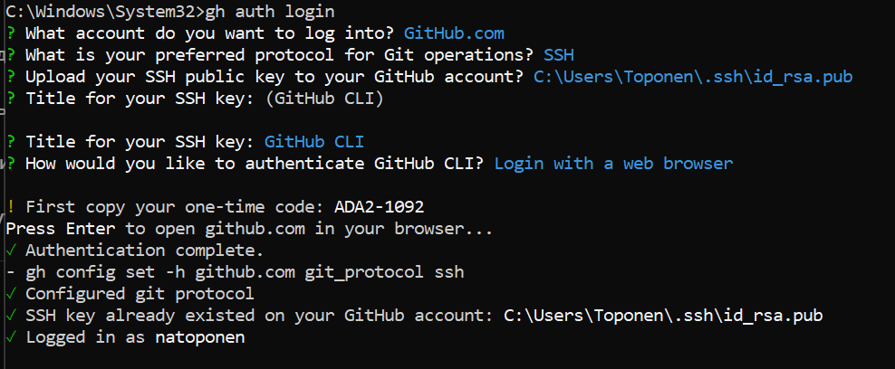

---
## Front matter
title: "Отчет по лабораторной работе по предмету Научное программирование"
subtitle: "Лабораторная работа №1. Управление версиями"
author: "Никита Андреевич Топонен"

## Generic otions
lang: ru-RU
toc-title: "Содержание"

## Bibliography
bibliography: bib/cite.bib
csl: pandoc/csl/gost-r-7-0-5-2008-numeric.csl

## Pdf output format
toc: true # Table of contents
toc-depth: 2
lof: true # List of figures
lot: true # List of tables
fontsize: 12pt
linestretch: 1.5
papersize: a4
documentclass: scrreprt
## I18n polyglossia
polyglossia-lang:
  name: russian
  options:
	- spelling=modern
	- babelshorthands=true
polyglossia-otherlangs:
  name: english
## I18n babel
babel-lang: russian
babel-otherlangs: english
## Fonts
mainfont: PT Serif
romanfont: PT Serif
sansfont: PT Sans
monofont: PT Mono
mainfontoptions: Ligatures=TeX
romanfontoptions: Ligatures=TeX
sansfontoptions: Ligatures=TeX,Scale=MatchLowercase
monofontoptions: Scale=MatchLowercase,Scale=0.9
## Biblatex
biblatex: true
biblio-style: "gost-numeric"
biblatexoptions:
  - parentracker=true
  - backend=biber
  - hyperref=auto
  - language=auto
  - autolang=other*
  - citestyle=gost-numeric
## Pandoc-crossref LaTeX customization
figureTitle: "Рис."
tableTitle: "Таблица"
listingTitle: "Листинг"
lofTitle: "Список иллюстраций"
lotTitle: "Список таблиц"
lolTitle: "Листинги"
## Misc options
indent: true
header-includes:
  - \usepackage{indentfirst}
  - \usepackage{float} # keep figures where there are in the text
  - \floatplacement{figure}{H} # keep figures where there are in the text
---

# Цель работы

- Изучить идеологию и применение средств контроля версий.
- Освоить умения по работе с git.

# Задание

- Создать базовую конфигурацию для работы с git.
- Создать ключ SSH.
- Создать ключ PGP.
- Настроить подписи git.
- Зарегистрироваться на Github.
- Создать локальный каталог для выполнения заданий по предмету.

# Теоретическое введение

Системы контроля версий (Version Control System, VCS) применяются при работе нескольких человек над одним проектом. Обычно основное дерево проекта хранится в локальном или удалённом репозитории, к которому настроен доступ для участников проекта. При внесении изменений в содержание проекта система контроля версий позволяет их фиксировать, совмещать изменения, произведённые разными участниками проекта, производить откат к любой более ранней версии проекта, если это требуется.

Система контроля версий Git представляет собой набор программ командной строки. Доступ к ним можно получить из терминала посредством ввода команды git с различными опциями

Благодаря тому, что Git является распределённой системой контроля версий, резервную копию локального хранилища можно сделать простым копированием или архивацией.

# Выполнение лабораторной работы

 Изучил материалы и команды представленные в материалах лабораторной работы.

У меня уже есть профиль на github, поэтому создавать его не пришлось.

{#fig:001 width=70%}

Ключ SSH также уже привязан к аккаунту, поэтому не выполнял повторной генерации.

{#fig:002 width=70%}

Установить ключ GPG не удалось, так как утилита для генерации не работала на моей машине, что видно на записи выполнения работы.

Установил утилиту gh с помощью chocolatey. Выполнил настройку gh, заполнив необходимые данные и авторизовавшись в браузере.

{#fig:003 width=70%}

Создал репозиторий рабочего пространства курса с помощью шаблона и утилиты gh.

{#fig:004 width=70%}

Далее удалил лишние файлы, выполнил make для создания структуры каталогов. После этого добавил файлы в индекс, выполнил коммит и отправил данные в удаленный репозиторий.

{#fig:005 width=70%}

{#fig:006 width=70%}

{#fig:007 width=70%}

# Выводы

В результате выполнения данной работы я:

- Познакомился с системой контроля версий git.
- Создал репозиторий курса с помощью утилиты gh.
- Отправил данные в удаленный репозиторий.

# Список литературы{.unnumbered}
