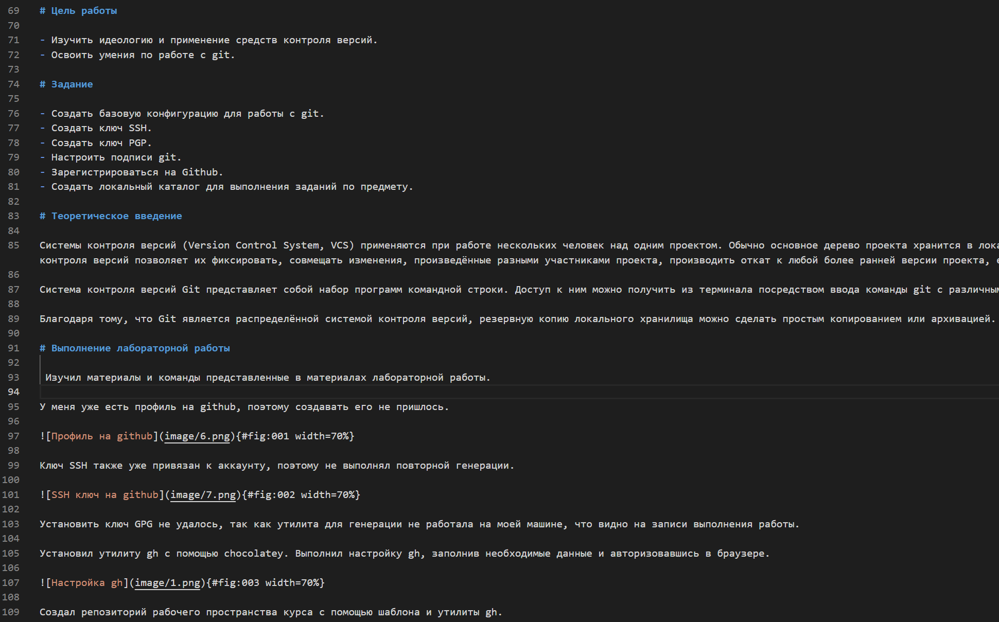
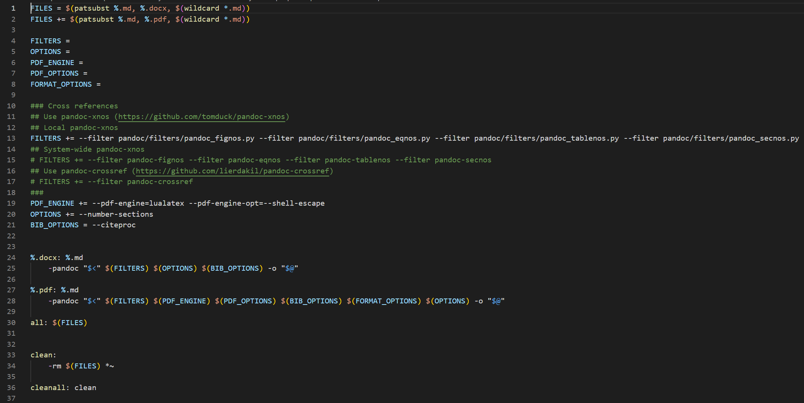
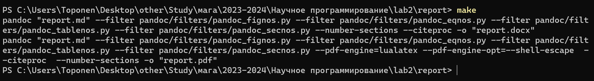
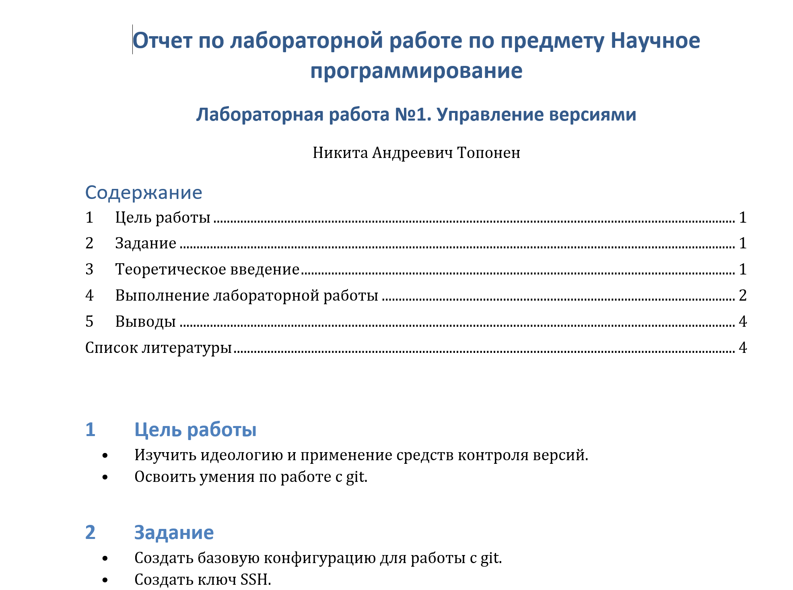
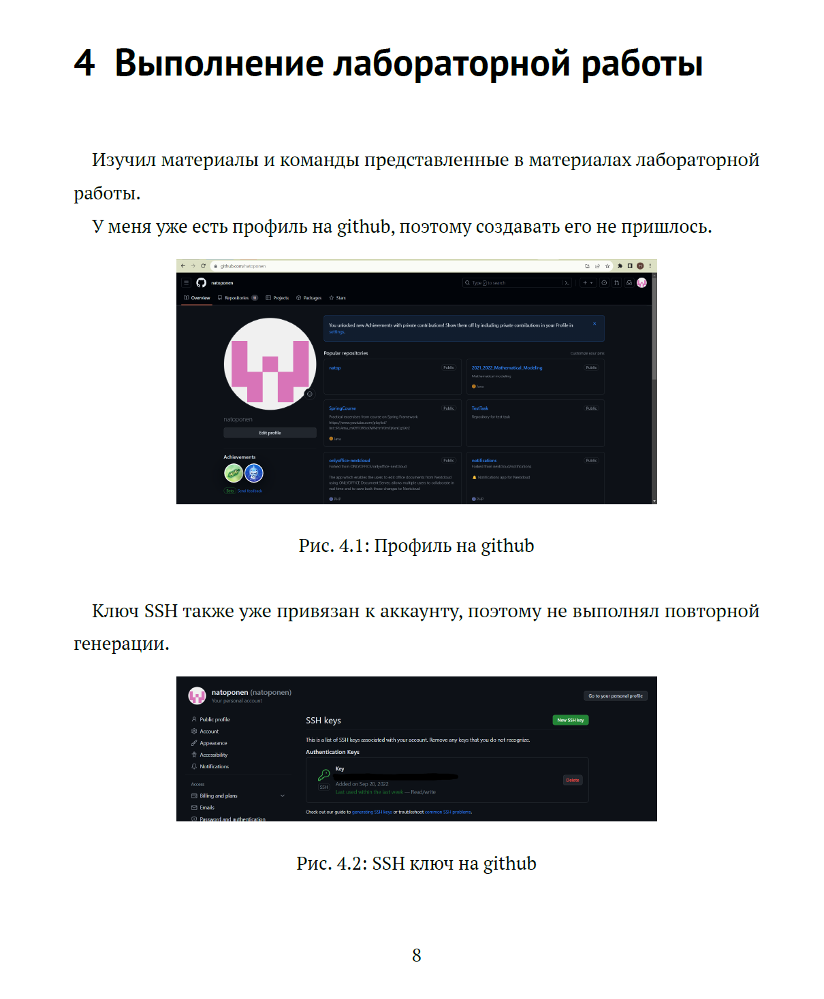

---
## Front matter
lang: ru-RU
title: Лабораторная работа №2
subtitle: Markdown
author:
  - Топонен Н. А.
institute:
  - Российский университет дружбы народов, Москва, Россия
date: 30 сентября 2023

## i18n babel
babel-lang: russian
babel-otherlangs: english

## Formatting pdf
toc: false
toc-title: Содержание
slide_level: 2
aspectratio: 169
section-titles: true
theme: metropolis
header-includes:
 - \metroset{progressbar=frametitle,sectionpage=progressbar,numbering=fraction}
 - '\makeatletter'
 - '\beamer@ignorenonframefalse'
 - '\makeatother'
---

# Информация

## Докладчик

:::::::::::::: {.columns align=center}
::: {.column width="70%"}

  * Топонен Никита Андреевич
  * студент Российского университет дружбы народов
  * [1132236933@rudn.ru](mailto:1132236933@rudn.ru)
  * <https://github.com/natoponen>

:::
::: {.column width="30%"}

:::
::::::::::::::

# Вводная часть

## Цель работы

- Научиться оформлять отчёты с помощью легковесного языка разметки Markdown.

## Задание

- Сделать отчёт по предыдущей лабораторной работе в формате Markdown.
- В качестве отчёта предоставить отчёты в 3 форматах: pdf, docx и md.

# Теоретическое введение

- Markdown -- легковесный язык разметки.
- Заголовки разных уровней.
- Списки.
- Цитирование.
- Код.
- Картинки.

# Выполнение лабораторной работы

## Создание отчета с помощью Markdown

{width=70%}

## Генерация отчета в docx и pdf

{width=70%}

## Генерация отчета в docx и pdf

## Отчет в docx

{width=50%}

## Отчет в pdf

{width=30%}

## Выводы

- Познакомился с языком разметки Markdown.
- Создал отчет по предыдущей работе с помощью Markdown.
- Сгенерировал отчет в docx и pdf из md файла.