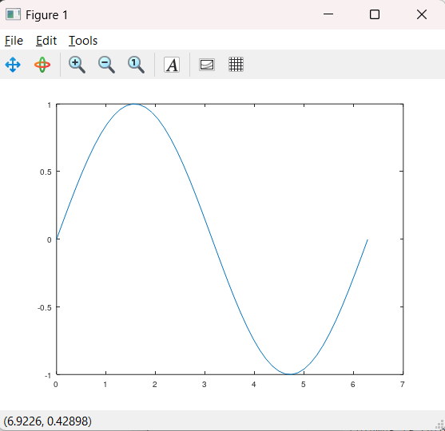
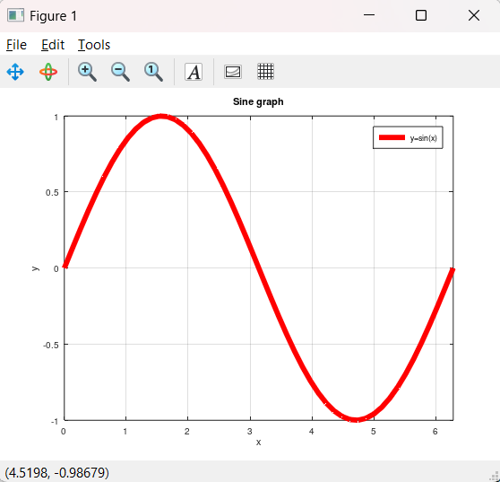
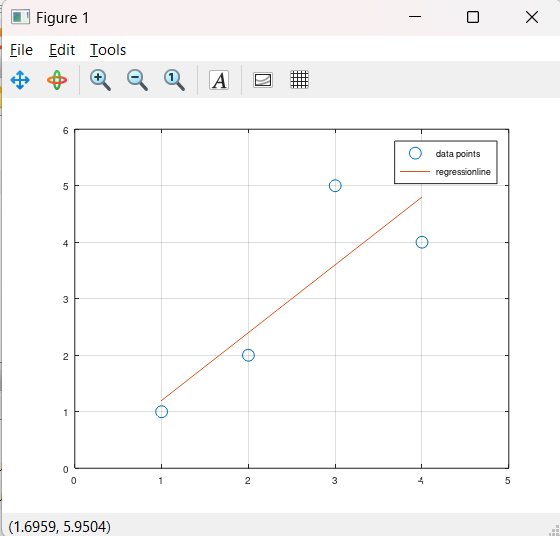
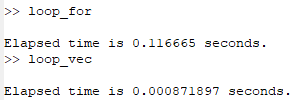

---
## Front matter
lang: ru-RU
title: Лабораторная работа №3
subtitle: Введение в работу с Octave
author:
  - Топонен Н. А.
institute:
  - Российский университет дружбы народов, Москва, Россия
date: 14 октября 2023

## i18n babel
babel-lang: russian
babel-otherlangs: english

## Formatting pdf
toc: false
toc-title: Содержание
slide_level: 2
aspectratio: 169
section-titles: true
theme: metropolis
header-includes:
 - \metroset{progressbar=frametitle,sectionpage=progressbar,numbering=fraction}
 - '\makeatletter'
 - '\beamer@ignorenonframefalse'
 - '\makeatother'
---

# Информация

## Докладчик

:::::::::::::: {.columns align=center}
::: {.column width="70%"}

  * Топонен Никита Андреевич
  * студент Российского университет дружбы народов
  * [1132236933@rudn.ru](mailto:1132236933@rudn.ru)
  * <https://github.com/natoponen>

:::
::: {.column width="30%"}

:::
::::::::::::::

# Вводная часть

## Цель работы

- Познакомиться с Octave.

## Задание

- Выполнить простейшие математические операции и построить графики с помощью Octave.

# Теоретическое введение

GNU Octave — свободная программная система для математических вычислений, использующая совместимый с MATLAB язык высокого уровня.

# Выполнение лабораторной работы

## Построение графиков

{#fig:001 width=40%}

## Построение графиков

{#fig:002 width=40%}

## Построение графиков

{#fig:003 width=40%}

## Построение графиков

{#fig:004 width=40%}

## Сравнение скорости выполнения

{#fig:005 width=70%}

## Выводы

- Познакомился с Octave.
- Научился выполнять простейшие математические операции в Octave.
- Научился строить графики и засекать время выполнения программы.