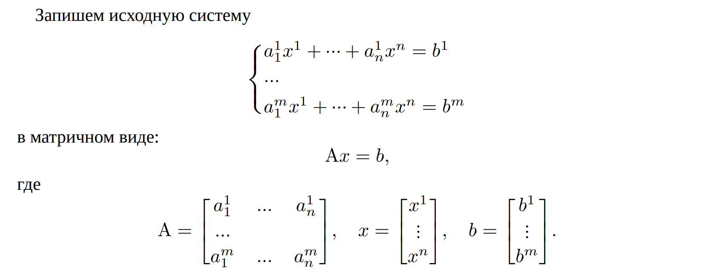
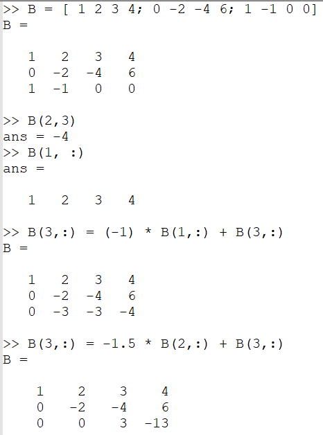
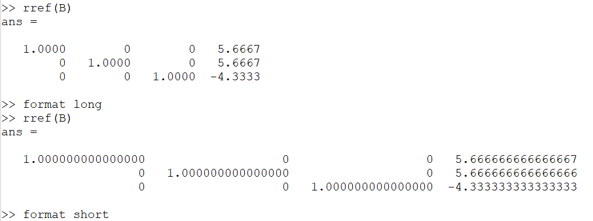
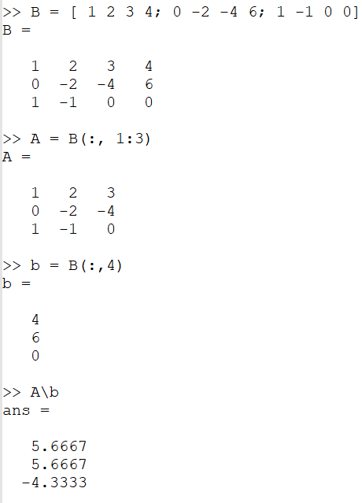
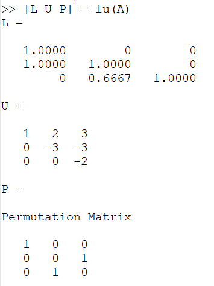

---
## Front matter
title: "Отчет по лабораторной работе по предмету Научное программирование"
subtitle: "Лабораторная работа №4. Системы линейных уравнений"
author: "Никита Андреевич Топонен"

## Generic otions
lang: ru-RU
toc-title: "Содержание"

## Bibliography
bibliography: bib/cite.bib
csl: pandoc/csl/gost-r-7-0-5-2008-numeric.csl

## Pdf output format
toc: true # Table of contents
toc-depth: 2
lof: true # List of figures
lot: true # List of tables
fontsize: 12pt
linestretch: 1.5
papersize: a4
documentclass: scrreprt
## I18n polyglossia
polyglossia-lang:
  name: russian
  options:
	- spelling=modern
	- babelshorthands=true
polyglossia-otherlangs:
  name: english
## I18n babel
babel-lang: russian
babel-otherlangs: english
## Fonts
mainfont: PT Serif
romanfont: PT Serif
sansfont: PT Sans
monofont: PT Mono
mainfontoptions: Ligatures=TeX
romanfontoptions: Ligatures=TeX
sansfontoptions: Ligatures=TeX,Scale=MatchLowercase
monofontoptions: Scale=MatchLowercase,Scale=0.9
## Biblatex
biblatex: true
biblio-style: "gost-numeric"
biblatexoptions:
  - parentracker=true
  - backend=biber
  - hyperref=auto
  - language=auto
  - autolang=other*
  - citestyle=gost-numeric
## Pandoc-crossref LaTeX customization
figureTitle: "Рис."
tableTitle: "Таблица"
listingTitle: "Листинг"
lofTitle: "Список иллюстраций"
lotTitle: "Список таблиц"
lolTitle: "Листинги"
## Misc options
indent: true
header-includes:
  - \usepackage{indentfirst}
  - \usepackage{float} # keep figures where there are in the text
  - \floatplacement{figure}{H} # keep figures where there are in the text
---

# Цель работы

- Научиться решать СЛАУ с помощью Octave.

# Задание

- Повторить примеры решения СЛАУ с помощью Octave.

# Теоретическое введение

{#fig:001 width=70%}

Матрица $A$ называется основной матрицей системы, $𝑏$ — столбцом свободных членов.

Алгоритм решения СЛАУ методом Гаусса подразделяется на два этапа.

- На первом этапе осуществляется так называемый прямой ход, когда путём элементарных преобразований над строками систему приводят к ступенчатой или треугольной форме, либо устанавливают, что система несовместна. А именно, среди элементов первого столбца матрицы выбирают ненулевой, перемещают его на крайнее верхнее положение перестановкой строк и вычитают получившуюся после перестановки первую строку из остальных строк, домножив её на величину, равную отношению первого элемента каждой из этих строк к первому элементу первой строки, обнуляя тем самым столбец под ним. После того, как указанные преобразования были совершены, первую строку и первый столбец мысленно вычёркивают и продолжают пока не останется матрица нулевого размера. Если на какой-то из итераций среди элементов первого столбца не нашёлся ненулевой, то переходят к следующему столбцу и проделывают аналогичную операцию.

- На втором этапе осуществляется так называемый обратный ход, суть которого заключается в том, чтобы выразить все получившиеся базисные переменные через небазисные и построить фундаментальную систему решений, либо, если все переменные являются базисными, то выразить в численном виде единственное решение системы линейных уравнений. Эта процедура начинается с последнего уравнения, из которого выражают соответствующую базисную переменную (а она там всего одна) и подставляют в предыдущие уравнения, и так далее, поднимаясь наверх. Каждой строчке соответствует ровно одна базисная переменная, поэтому на каждом шаге, кроме последнего (самого верхнего), ситуация в точности повторяет случай последней строки. Для приведения матрицы к треугольному виду для системы уравнений $A𝑥 = b$ используют расширенную матрицу вида:

{#fig:002 width=70%}

$LU$-разложение — это вид факторизации матриц для метода Гаусса. Цель состоит в том, чтобы записать матрицу $A$ в виде $A = LU$, где $L$ — нижняя треугольная матрица, а $U$ — верхняя треугольная матрица.

$LU$-разложение существует только в том случае, когда матрица $A$ обратима, а все главные миноры матрицы $A$ невырождены.

# Выполнение лабораторной работы

Повторял примеры из материалов лабораторной работы.

Привел расширенную матрицу к верхнему треугольному виду "в ручную".

{#fig:003 width=70%}

Далее привел расширенную матрицу к верхнему треугольному виду с помощью встроенной функции с разным количеством знаков после запятой.

{#fig:004 width=70%}

Затем решил СЛАУ так называемым левым делением в Octave.

{#fig:005 width=70%}

В конце нашел $LUP$ разложение матрицы с помощью функции $lu$.

{#fig:006 width=70%}

# Выводы

В результате выполнения данной работы я:

- Научился решать СЛАУ в Octave.

# Список литературы{.unnumbered}
