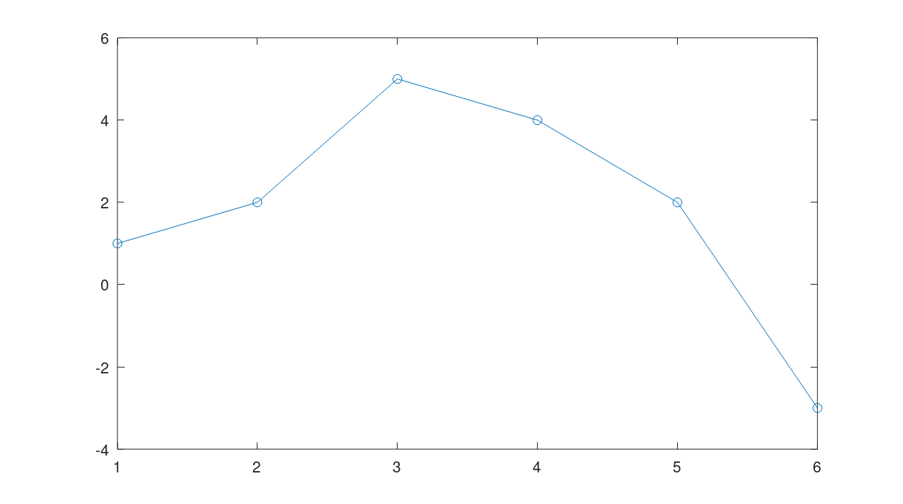
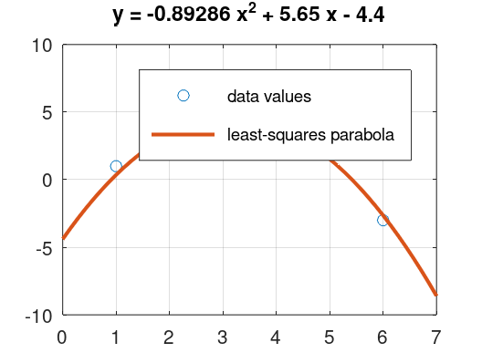
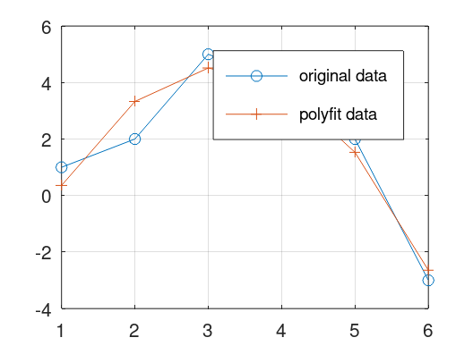
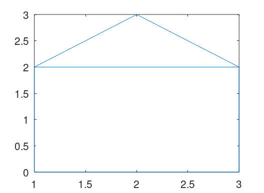
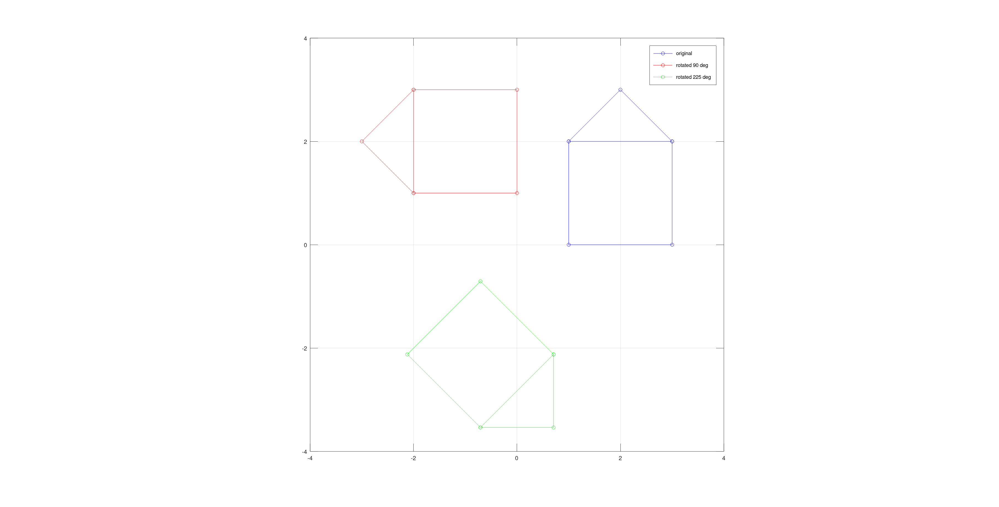
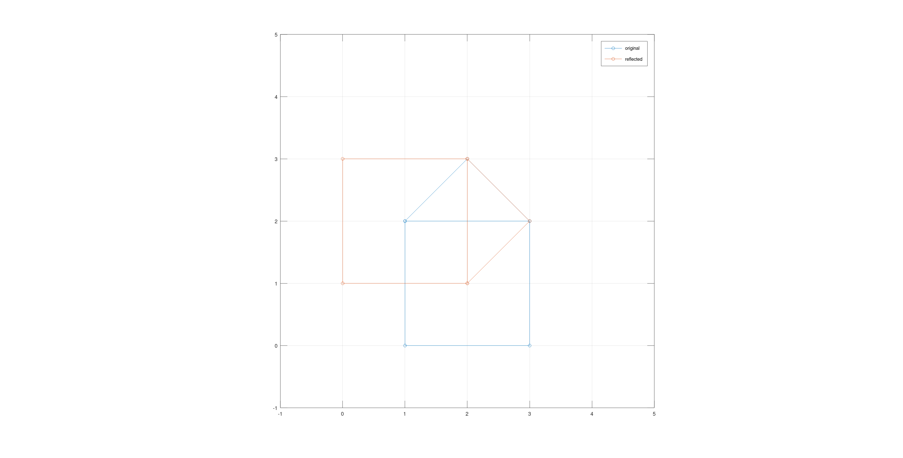
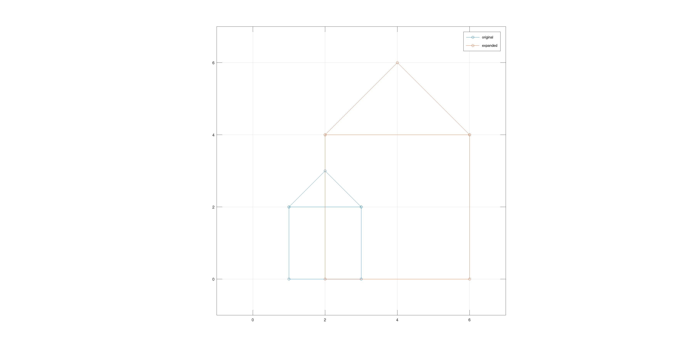

---
## Front matter
lang: ru-RU
title: Лабораторная работа №5
subtitle: Подгонка полиномиальной кривой. Матричные преобразования
author:
  - Топонен Н. А.
institute:
  - Российский университет дружбы народов, Москва, Россия
date: 4 ноября 2023

## i18n babel
babel-lang: russian
babel-otherlangs: english

## Formatting pdf
toc: false
toc-title: Содержание
slide_level: 2
aspectratio: 169
section-titles: true
theme: metropolis
header-includes:
 - \metroset{progressbar=frametitle,sectionpage=progressbar,numbering=fraction}
 - '\makeatletter'
 - '\beamer@ignorenonframefalse'
 - '\makeatother'
---

# Информация

## Докладчик

:::::::::::::: {.columns align=center}
::: {.column width="70%"}

  * Топонен Никита Андреевич
  * студент Российского университет дружбы народов
  * [1132236933@rudn.ru](mailto:1132236933@rudn.ru)
  * <https://github.com/natoponen>

:::
::: {.column width="30%"}

:::
::::::::::::::

# Вводная часть

## Цель работы

- Научиться подгонке полиномиальной кривой и матричным преобразованиям в Octave.

## Задание

- Повторить примеры подгонки полиномиальной кривой и матричные преобразования с помощью Octave.

# Теоретическое введение

- В статистике часто рассматривается проблема подгонки прямой линии к набору данных. Имея набор данных (точек) необходимо построить полиномиальную кривую, наиболее приближающуюся к данным точкам.

- Матрицы и матричные преобразования играют ключевую роль в компьютерной графике. Существует несколько способов представления изображения в виде матрицы. Подход, который мы здесь используем, состоит в том, чтобы перечислить ряд вершин, которые соединены последовательно, чтобы получить ребра простого графа. Мы записываем это как матрицу $2*n$, где каждый столбец представляет точку на рисунке.

# Выполнение лабораторной работы

## Подгонка прямой ч.1

{#fig:001 width=80%}

## Подгонка прямой ч.2

{#fig:002 width=50%}

## Подгонка прямой ч.3

{#fig:003 width=50%}

## Граф по точкам

{#fig:004 width=50%}

## Вращение

{#fig:005 width=80%}

## Отражение относительно прямой

{#fig:006 width=80%}

## Дилатация

{#fig:007 width=80%}

## Выводы

- Научился подгонке полиномиальной кривой и матричным преобразованиям в Octave.