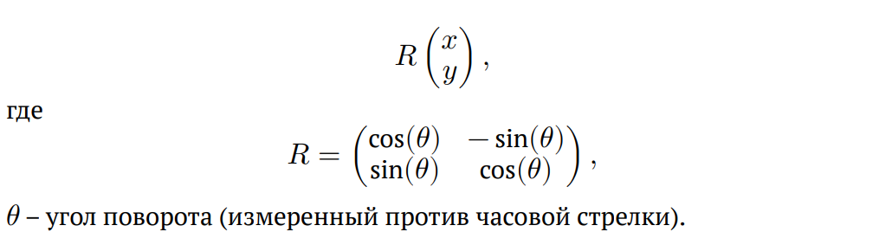
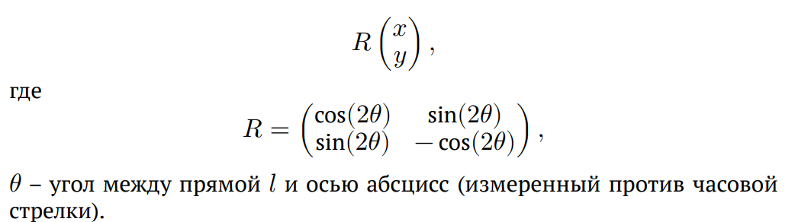
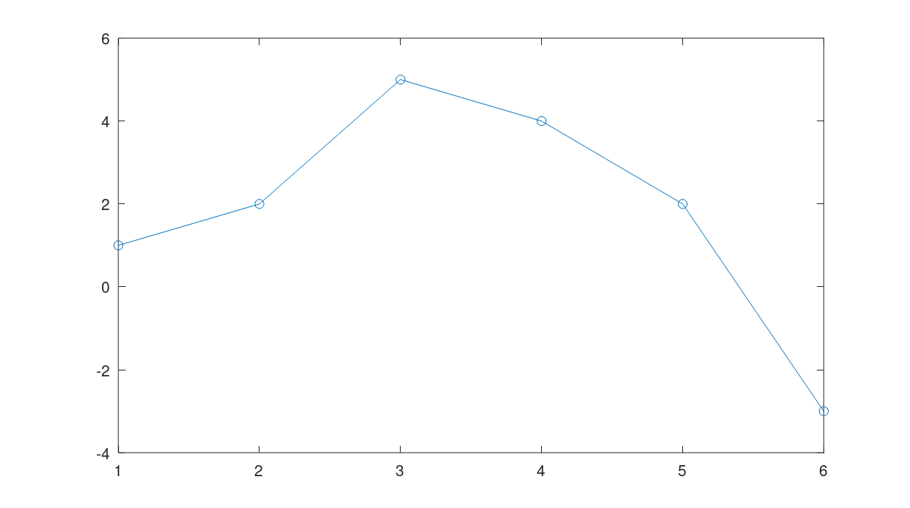
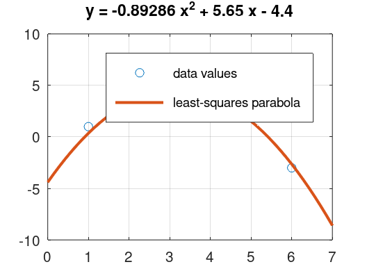
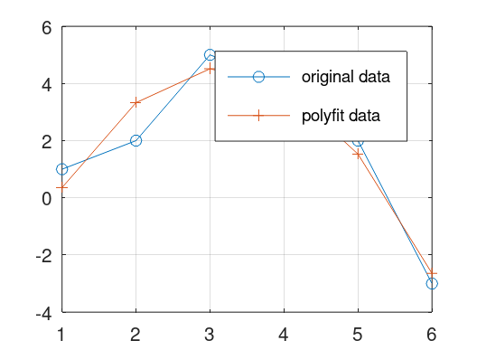
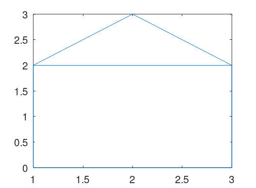
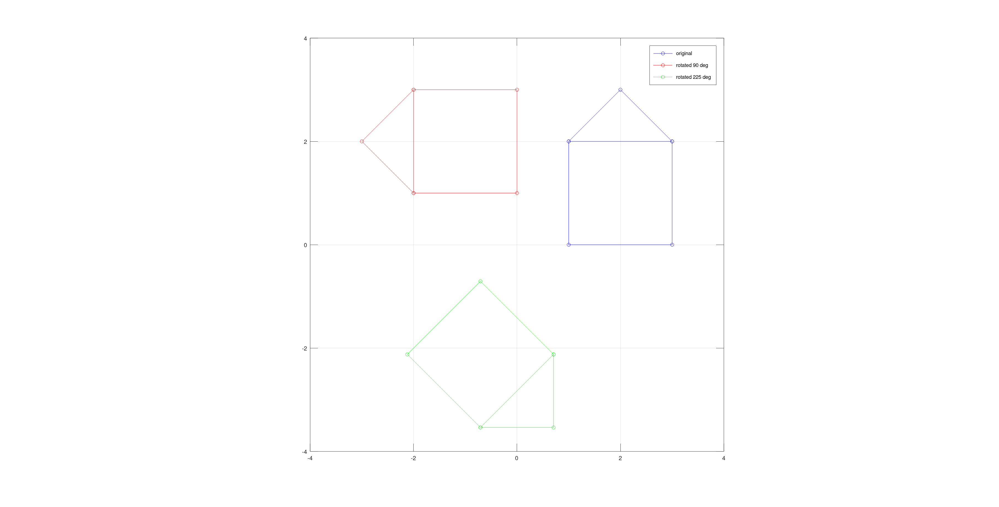
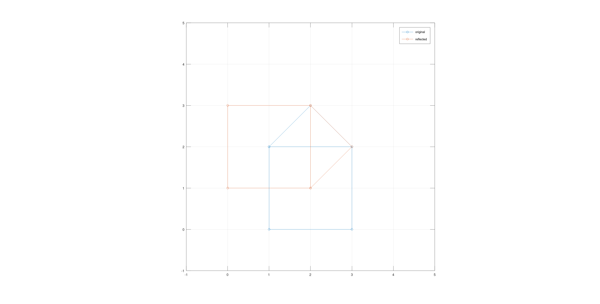
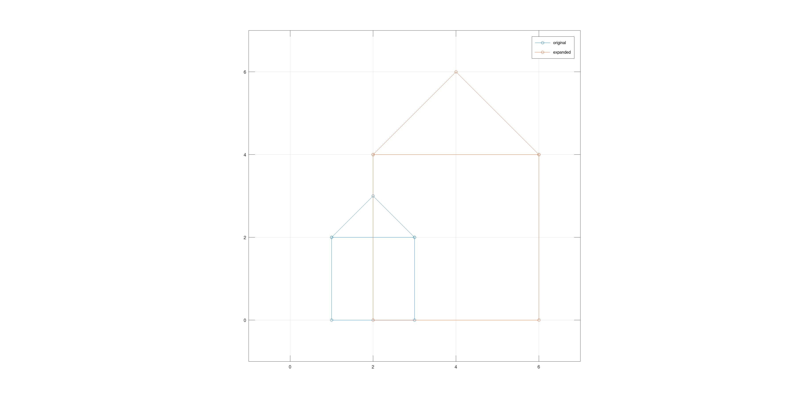

---
## Front matter
title: "Отчет по лабораторной работе по предмету Научное программирование"
subtitle: "Лабораторная работа №5. Подгонка полиномиальной кривой. Матричные преобразования."
author: "Никита Андреевич Топонен"

## Generic otions
lang: ru-RU
toc-title: "Содержание"

## Bibliography
bibliography: bib/cite.bib
csl: pandoc/csl/gost-r-7-0-5-2008-numeric.csl

## Pdf output format
toc: true # Table of contents
toc-depth: 2
lof: true # List of figures
lot: true # List of tables
fontsize: 12pt
linestretch: 1.5
papersize: a4
documentclass: scrreprt
## I18n polyglossia
polyglossia-lang:
  name: russian
  options:
	- spelling=modern
	- babelshorthands=true
polyglossia-otherlangs:
  name: english
## I18n babel
babel-lang: russian
babel-otherlangs: english
## Fonts
mainfont: PT Serif
romanfont: PT Serif
sansfont: PT Sans
monofont: PT Mono
mainfontoptions: Ligatures=TeX
romanfontoptions: Ligatures=TeX
sansfontoptions: Ligatures=TeX,Scale=MatchLowercase
monofontoptions: Scale=MatchLowercase,Scale=0.9
## Biblatex
biblatex: true
biblio-style: "gost-numeric"
biblatexoptions:
  - parentracker=true
  - backend=biber
  - hyperref=auto
  - language=auto
  - autolang=other*
  - citestyle=gost-numeric
## Pandoc-crossref LaTeX customization
figureTitle: "Рис."
tableTitle: "Таблица"
listingTitle: "Листинг"
lofTitle: "Список иллюстраций"
lotTitle: "Список таблиц"
lolTitle: "Листинги"
## Misc options
indent: true
header-includes:
  - \usepackage{indentfirst}
  - \usepackage{float} # keep figures where there are in the text
  - \floatplacement{figure}{H} # keep figures where there are in the text
---

# Цель работы

- Научиться подгонке полиномиальной кривой и матричным преобразованиям в Octave.

# Задание

- Повторить примеры подгонки полиномиальной кривой и матричные преобразования с помощью Octave.

# Теоретическое введение

- В статистике часто рассматривается проблема подгонки прямой линии к набору данных. Имея набор данных (точек) необходимо построить полиномиальную кривую, наиболее приближающуюся к данным точкам.

- Матрицы и матричные преобразования играют ключевую роль в компьютерной графике. Существует несколько способов представления изображения в виде матрицы. Подход, который мы здесь используем, состоит в том, чтобы перечислить ряд вершин, которые соединены последовательно, чтобы получить ребра простого графа. Мы записываем это как матрицу $2*n$, где каждый столбец представляет точку на рисунке.

- Вращения могут быть получены с использованием умножения на специальную матрицу. Вращение точки $(x, y)$ относительно начала координат определяется как:

{#fig:001 width=70%}

- Если $l$ – прямая, проходящая через начало координат, то отражение точки $(x, y)$ относительно прямой $l$ определяется как:

{#fig:002 width=70%}

- Дилатация (то есть расширение или сжатие) также может быть выполнено путём умножения матриц. Пусть

{#fig:003 width=70%}

Тогда матричное произведение $TD$ будет преобразованием дилатации $D$ с коэффициентом $k$.

# Выполнение лабораторной работы

Повторял примеры из материалов лабораторной работы.

Построил график точек, по которым будем строить полином.

{#fig:004 width=70%}

Построил уравнение вида $y = ax^2 + bx + c$. Решил его и построил график полинома и точек, к которым мы приводили полином.

{#fig:005 width=70%}

Проделал ту же подгонку с помощью функций Octave (polyfit и polyval).

{#fig:006 width=70%}

Нарисовал граф домика по точкам.

{#fig:007 width=70%}

Выполнил вращение с помощью матрицы вращения. Нарисовал на одном полотне начальный граф, а также графы повернутые на 90 и 225 градусов вокруг начала координат.

{#fig:008}

Выполнил отражение домика относительно прямой.

{#fig:009}

Выполнил дилатацию, увеличив домик в 2 раза.

{#fig:010}

# Выводы

В результате выполнения данной работы я:

- Научился подгонке полиномиальной кривой и матричным преобразованиям в Octave.

# Список литературы{.unnumbered}
