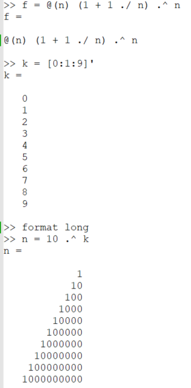
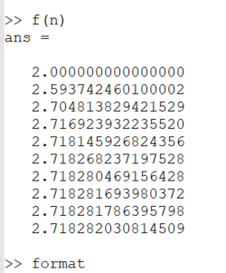
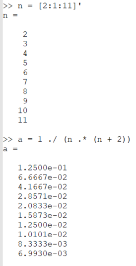
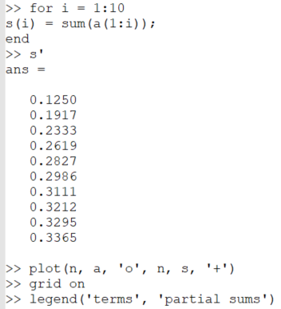
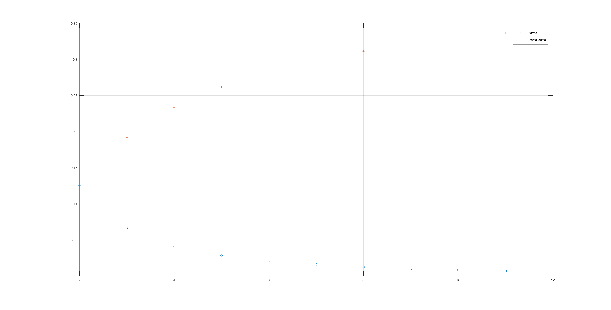
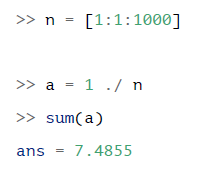
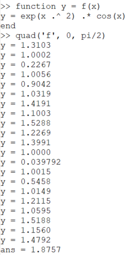
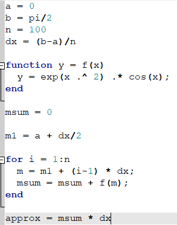
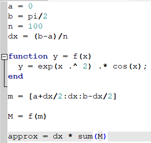
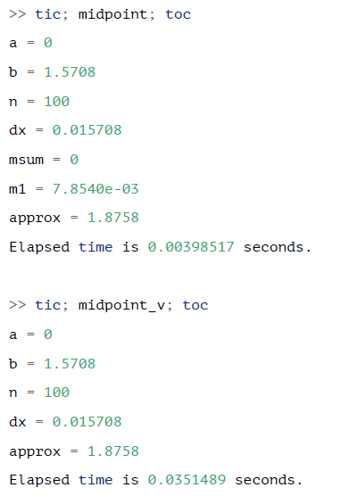

---
## Front matter
lang: ru-RU
title: Лабораторная работа №6
subtitle: Пределы, последовательности и ряды
author:
  - Топонен Н. А.
institute:
  - Российский университет дружбы народов, Москва, Россия
date: 13 ноября 2023

## i18n babel
babel-lang: russian
babel-otherlangs: english

## Formatting pdf
toc: false
toc-title: Содержание
slide_level: 2
aspectratio: 169
section-titles: true
theme: metropolis
header-includes:
 - \metroset{progressbar=frametitle,sectionpage=progressbar,numbering=fraction}
 - '\makeatletter'
 - '\beamer@ignorenonframefalse'
 - '\makeatother'
---

# Информация

## Докладчик

:::::::::::::: {.columns align=center}
::: {.column width="70%"}

  * Топонен Никита Андреевич
  * студент Российского университет дружбы народов
  * [1132236933@rudn.ru](mailto:1132236933@rudn.ru)
  * <https://github.com/natoponen>

:::
::: {.column width="30%"}

:::
::::::::::::::

# Вводная часть

## Цель работы

- Научиться работать с пределами, последовательностями и рядами в Octave.

## Задание

- Повторить примеры частичных сумм, суммы ряда, численного вычисления интегралов с помощью циклов и векторного вычисления в Octave.

# Теоретическое введение

- Octave - полноценный язык программирования, поддерживающий множество типов циклов и условных операторов. 
- Однако, поскольку это векторный язык, многие вещи, которые можно было бы сделать с помощью циклов, можно векторизовать. (Под векторизованным кодом мы понимаем следующее: вместо того, чтобы писать цикл для многократной оценки функции, мы сгенерируем вектор входных значений, а затем оценим функцию с использованием векторного ввода.) 
- В результате получается код, который легче читать и понимать, и он выполняется быстрее благодаря эффективным алгоритмам для матричных операций.

# Выполнение лабораторной работы

## Оценка предела

{#fig:001 width=20%}

## Оценка предела

{#fig:002 width=30%}

## Вычисление частичных сумм

{#fig:003 width=20%}

## Вычисление частичных сумм

{#fig:004 width=30%}

## Вычисление частичных сумм

{#fig:005 width=80%}

## Вычисление суммы ряда

{#fig:006 width=50%}

## Вычисление значения интеграла

{#fig:007 width=20%}

## Вычисление значения интеграла

{#fig:009 width=30%}

## Вычисление значения интеграла

{#fig:009 width=30%}

## Вычисление значения интеграла

{#fig:010 width=30%}

## Выводы

- Научился работать с пределами, последовательностями и рядами в Octave.