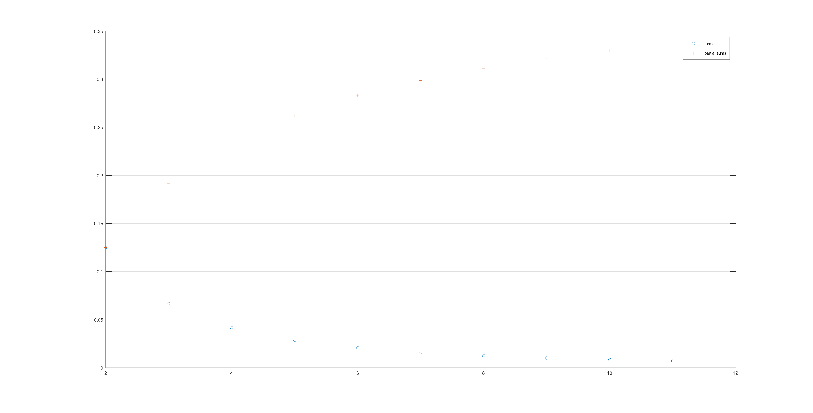

---
## Front matter
title: "Отчет по лабораторной работе по предмету Научное программирование"
subtitle: "Лабораторная работа №6. Пределы, последовательности и ряды."
author: "Никита Андреевич Топонен"

## Generic otions
lang: ru-RU
toc-title: "Содержание"

## Bibliography
bibliography: bib/cite.bib
csl: pandoc/csl/gost-r-7-0-5-2008-numeric.csl

## Pdf output format
toc: true # Table of contents
toc-depth: 2
lof: true # List of figures
lot: true # List of tables
fontsize: 12pt
linestretch: 1.5
papersize: a4
documentclass: scrreprt
## I18n polyglossia
polyglossia-lang:
  name: russian
  options:
	- spelling=modern
	- babelshorthands=true
polyglossia-otherlangs:
  name: english
## I18n babel
babel-lang: russian
babel-otherlangs: english
## Fonts
mainfont: PT Serif
romanfont: PT Serif
sansfont: PT Sans
monofont: PT Mono
mainfontoptions: Ligatures=TeX
romanfontoptions: Ligatures=TeX
sansfontoptions: Ligatures=TeX,Scale=MatchLowercase
monofontoptions: Scale=MatchLowercase,Scale=0.9
## Biblatex
biblatex: true
biblio-style: "gost-numeric"
biblatexoptions:
  - parentracker=true
  - backend=biber
  - hyperref=auto
  - language=auto
  - autolang=other*
  - citestyle=gost-numeric
## Pandoc-crossref LaTeX customization
figureTitle: "Рис."
tableTitle: "Таблица"
listingTitle: "Листинг"
lofTitle: "Список иллюстраций"
lotTitle: "Список таблиц"
lolTitle: "Листинги"
## Misc options
indent: true
header-includes:
  - \usepackage{indentfirst}
  - \usepackage{float} # keep figures where there are in the text
  - \floatplacement{figure}{H} # keep figures where there are in the text
---

# Цель работы

- Научиться работать с пределами, последовательностями и рядами в Octave.

# Задание

- Повторить примеры частичных сумм, суммы ряда, численного вычисления интегралов с помощью циклов и векторного вычисления в Octave.

# Теоретическое введение

Octave - полноценный язык программирования, поддерживающий множество типов циклов и условных операторов. Однако, поскольку это векторный язык, многие вещи, которые можно было бы сделать с помощью циклов, можно векторизовать. Под векторизованным кодом мы понимаем следующее: вместо того, чтобы писать цикл для многократной оценки функции, мы сгенерируем вектор входных значений, а затем оценим функцию с использованием векторного ввода. В результате получается код, который легче читать и понимать, и он выполняется быстрее благодаря эффективным алгоритмам для матричных операций.

# Выполнение лабораторной работы

Повторял примеры из материалов лабораторной работы.

Оценил предел с помощью анонимной функции.

```octave
>> f = @(n) (1 + 1 ./ n) .^ n
f =

@(n) (1 + 1 ./ n) .^ n

>> k = [0:1:9]
k =

   0   1   2   3   4   5   6   7   8   9

>> k = [0:1:9]'
k =

   0
   1
   2
   3
   4
   5
   6
   7
   8
   9

>> format long
>> n = 10 .^ k
n =

            1
           10
          100
         1000
        10000
       100000
      1000000
     10000000
    100000000
   1000000000

>> f(n)
ans =

   2.000000000000000
   2.593742460100002
   2.704813829421529
   2.716923932235520
   2.718145926824356
   2.718268237197528
   2.718280469156428
   2.718281693980372
   2.718281786395798
   2.718282030814509
   
>> format
```

Предел сходится к 2,71828.

Далее вычислил частичные суммы ряда с $n$-м членом равным $\frac{1}{n(n+2)}$.

```octave
>> n = [2:1:11]'
n =

    2
    3
    4
    5
    6
    7
    8
    9
   10
   11

>> a = 1 ./ (n .* (n + 2))
a =

   1.2500e-01
   6.6667e-02
   4.1667e-02
   2.8571e-02
   2.0833e-02
   1.5873e-02
   1.2500e-02
   1.0101e-02
   8.3333e-03
   6.9930e-03

>> for i = 1:10
s(i) = sum(a(1:i));
end
>> s'
ans =

   0.1250
   0.1917
   0.2333
   0.2619
   0.2827
   0.2986
   0.3111
   0.3212
   0.3295
   0.3365
```

Затем построил график слагаемых и частичных сумм.

{#fig:001 width=70%}

После этого вычислил сумму первых 1000 членов ряда $\sum_{n=1}^{1000}\frac{1}{n}$.

```octave
>> n = [1:1:1000]

>> a = 1 ./ n
>> sum(a)
ans = 7.4855
```

Сумма равна 7.4855.

Далее вычислил значение интеграла с помощью встроенной функции Octave quad.

```octave
>> function y = f(x)
y = exp(x .^ 2) .* cos(x)
end
>> quad('f', 0, pi/2)
y = 1.3103
y = 1.0002
y = 0.2267
y = 1.0056
y = 0.9042
y = 1.0319
y = 1.4191
y = 1.1003
y = 1.5288
y = 1.2269
y = 1.3991
y = 1.0000
y = 0.039792
y = 1.0015
y = 0.5458
y = 1.0149
y = 1.2115
y = 1.0595
y = 1.5188
y = 1.1560
y = 1.4792
ans = 1.8757
```

Затем вычислил тот же интеграл методом средней точки сначала с помощью цикла, а затем векторно.

- С помощью цикла:

```octave
a = 0
b = pi/2
n = 100
dx = (b-a)/n

function y = f(x)
  y = exp(x .^ 2) .* cos(x);
end

msum = 0

m1 = a + dx/2

for i = 1:n
  m = m1 + (i-1) * dx;
  msum = msum + f(m);
end

approx = msum * dx
```

- Векторно:

```octave
a = 0
b = pi/2
n = 100
dx = (b-a)/n

function y = f(x)
  y = exp(x .^ 2) .* cos(x);
end

m = [a+dx/2:dx:b-dx/2]

M = f(m)

approx = dx * sum(M)
```

Получил следующие результаты, вычисляя скорость выполнения обоих программ:

```octave
>> tic; midpoint; toc
a = 0
b = 1.5708
n = 100
dx = 0.015708
msum = 0
m1 = 7.8540e-03
approx = 1.8758
Elapsed time is 0.00398517 seconds.

>> tic; midpoint_v; toc
a = 0
b = 1.5708
n = 100
dx = 0.015708
approx = 1.8758
Elapsed time is 0.0351489 seconds.
```

Видим, что программа с циклом выполнилась примерно в 10 раз быстрее.

# Выводы

В результате выполнения данной работы я:

- Научился работать с пределами, последовательностями и рядами в Octave.

# Список литературы{.unnumbered}
