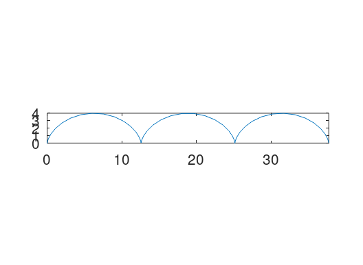
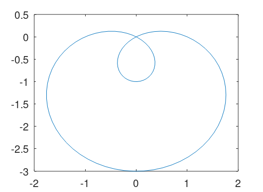
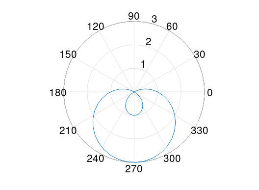
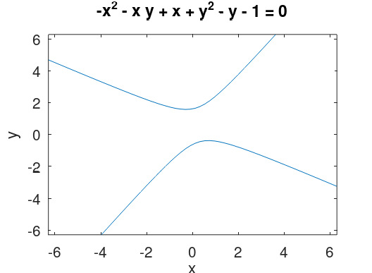
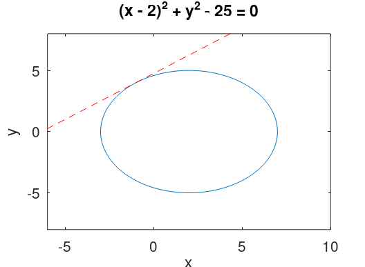
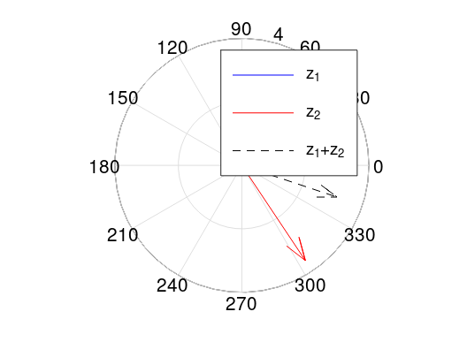
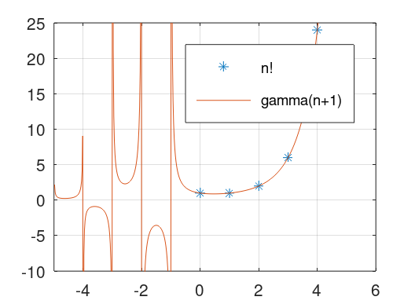
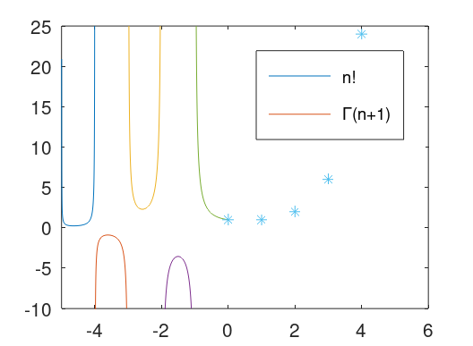

---
## Front matter
lang: ru-RU
title: Лабораторная работа №7
subtitle: Графики
author:
  - Топонен Н. А.
institute:
  - Российский университет дружбы народов, Москва, Россия
date: 9 декабря 2023

## i18n babel
babel-lang: russian
babel-otherlangs: english

## Formatting pdf
toc: false
toc-title: Содержание
slide_level: 2
aspectratio: 169
section-titles: true
theme: metropolis
header-includes:
 - \metroset{progressbar=frametitle,sectionpage=progressbar,numbering=fraction}
 - '\makeatletter'
 - '\beamer@ignorenonframefalse'
 - '\makeatother'
---

# Информация

## Докладчик

:::::::::::::: {.columns align=center}
::: {.column width="70%"}

  * Топонен Никита Андреевич
  * студент Российского университет дружбы народов
  * [1132236933@rudn.ru](mailto:1132236933@rudn.ru)
  * <https://github.com/natoponen>

:::
::: {.column width="30%"}

:::
::::::::::::::

# Вводная часть

## Цель работы

- Научиться работать с различными видами графиков в Octave.

## Задание

- Повторить примеры построения различных графиков в Octave.

# Выполнение лабораторной работы

## График циклоиды

{#fig:001 width=60%}

## График улитки Паскаля

{#fig:002 width=60%}

## График улитки Паскаля

{#fig:003 width=60%}

## График неявной функции

{#fig:004 width=60%}

## График окружности с касательной

{#fig:005 width=60%}

## Графики в комплексной плоскости

{#fig:006 width=60%}

## Графики гамма-функции и n!

{#fig:007 width=60%}

## Графики гамма-функции и n!

{#fig:008 width=60%}

## Выводы

- Научился строить различные графики в Octave.