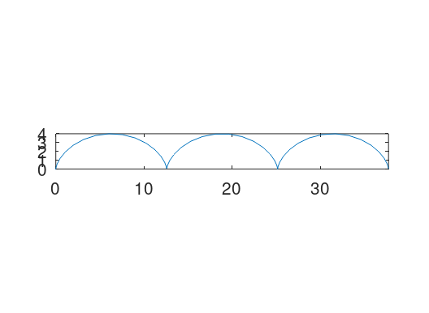
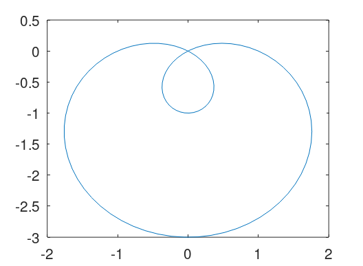
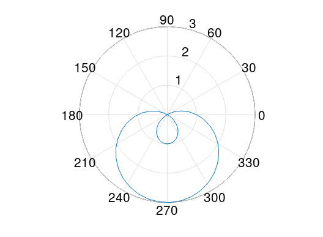
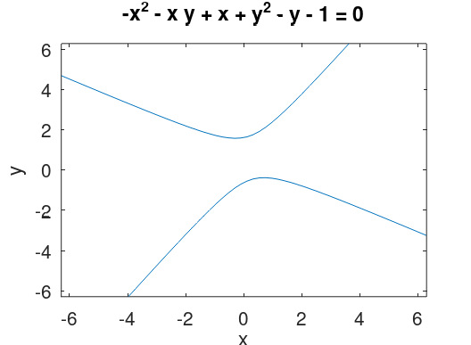
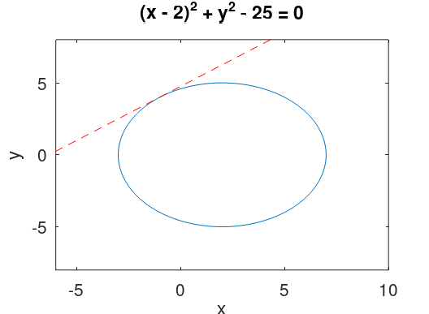
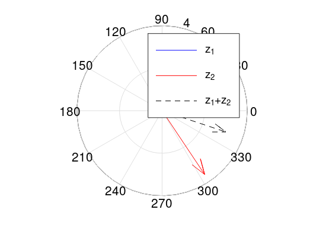
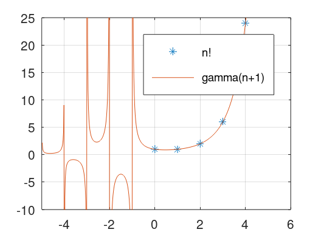
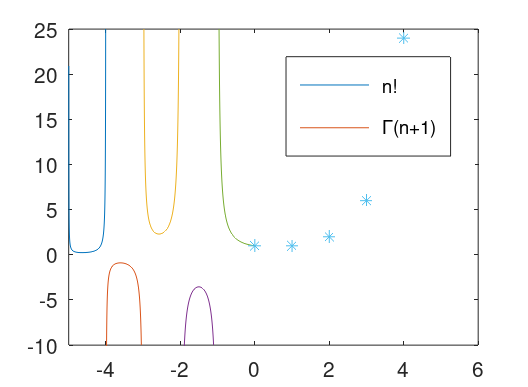

---
## Front matter
title: "Отчет по лабораторной работе по предмету Научное программирование"
subtitle: "Лабораторная работа №7. Графики."
author: "Никита Андреевич Топонен"

## Generic otions
lang: ru-RU
toc-title: "Содержание"

## Bibliography
bibliography: bib/cite.bib
csl: pandoc/csl/gost-r-7-0-5-2008-numeric.csl

## Pdf output format
toc: true # Table of contents
toc-depth: 2
lof: true # List of figures
lot: true # List of tables
fontsize: 12pt
linestretch: 1.5
papersize: a4
documentclass: scrreprt
## I18n polyglossia
polyglossia-lang:
  name: russian
  options:
	- spelling=modern
	- babelshorthands=true
polyglossia-otherlangs:
  name: english
## I18n babel
babel-lang: russian
babel-otherlangs: english
## Fonts
mainfont: PT Serif
romanfont: PT Serif
sansfont: PT Sans
monofont: PT Mono
mainfontoptions: Ligatures=TeX
romanfontoptions: Ligatures=TeX
sansfontoptions: Ligatures=TeX,Scale=MatchLowercase
monofontoptions: Scale=MatchLowercase,Scale=0.9
## Biblatex
biblatex: true
biblio-style: "gost-numeric"
biblatexoptions:
  - parentracker=true
  - backend=biber
  - hyperref=auto
  - language=auto
  - autolang=other*
  - citestyle=gost-numeric
## Pandoc-crossref LaTeX customization
figureTitle: "Рис."
tableTitle: "Таблица"
listingTitle: "Листинг"
lofTitle: "Список иллюстраций"
lotTitle: "Список таблиц"
lolTitle: "Листинги"
## Misc options
indent: true
header-includes:
  - \usepackage{indentfirst}
  - \usepackage{float} # keep figures where there are in the text
  - \floatplacement{figure}{H} # keep figures where there are in the text
---

# Цель работы

- Научиться работать с различными видами графиков в Octave.

# Задание

- Повторить примеры построения различных графиков в Octave.

# Выполнение лабораторной работы

Повторял примеры из материалов лабораторной работы.

Построил параметрический график циклоиды $x = r(t - \sin(t)), \quad y = r(1-\cos(t))$ на $0 \le t \le 6\pi$.

```octave
>> t = linspace(0, 6*pi, 50)
>> r = 2
r = 2
>> x = r*(t-sin(t))
>> y = r*(1-cos(t))
>> plot(x,y)
>> axis('equal')
>> axis([0 12*pi 0 4])
```

Получил следующий результат.

{#fig:001 width=90%}

Далее построил улитку Паскаля --- график $r = 1 - 2\sin(\theta)$ в полярных координатах.

```octave
>> theta = linspace(0, 2*pi, 100)
>> r = 1-2*sin(theta)
>> x = r.*cos(theta)
>> y = r.*sin(theta)
>> plot(x,y)
```

Получил следующий результат.

{#fig:002 width=90%}

Также построил улитку Паскаля с помощью встроенной команды Octave --- *polar*.

```octave
>> theta = linspace(0, 2*pi, 50)
>> r = 1-2*sin(theta)
>> polar(theta, r)
```

Получил следующий результат.

{#fig:003 width=90%}

Затем построил график неявной функции с помощью команды *ezplot*.

```octave
>> f = @(x,y) -x.^2-x.*y+x+y.^2-y-1
f =

@(x, y) -x .^ 2 - x .* y + x + y .^ 2 - y - 1

>> ezplot(f)
```

Получил следующий результат.

{#fig:004 width=90%}

Далее построил график окружности радиуса 5 с центром в точке (2,0), а также касательную к ней в точке (-1,4).

```octave
>> f = @(x,y) (x-2).^2 + y.^2 -25
f =

@(x, y) (x - 2) .^ 2 + y .^ 2 - 25

>> ezplot(f, [-6 10 -8 8])
>> x = [-6:10]
x =

   -6   -5   -4   -3   -2   -1    0    1    2    3    4    5    6    7    8    9   10

>> y = 3/4*x + 19/4
>> hold on
>> plot(x,y, 'r--')
```

Получил следующий результат.

{#fig:005 width=90%}

После этого научился работе с комплексными числами.

```octave
>> z1 = 1 + 2*i
z1 =  1 + 2i
>> z2 = 2 - 3*i
z2 =  2 - 3i
>> z1 + z2
ans =  3 - 1i
>> z1 - z2
ans = -1 + 5i
>> z1*z2
ans =  8 + 1i
>> z1/z2
ans = -0.3077 + 0.5385i
```

Далее построил графики в комплексной плоскости, используя команду *compass*.

```octave
>> z1 = 1+2*i
z1 =  1 + 2i
>> z2 = 2-3*i
z2 =  2 - 3i
>> compass(z1, 'b')
>> compass(z2, 'b')
>> compass(z1, 'b')
>> hold on
>> compass(z2, 'r')
>> compass(z1+z2, 'k--')
>> legend('z_1', 'z_2', 'z_1+z_2')
```

Получил следующий результат.

{#fig:006 width=90%}

В конце построил графики гамма-функции и n! на одном графике, чтобы показать, что выполняется $\Gamma(n) = (n+1)!$.

```octave
>> n = [0:1:5]
>> x = linspace(-5,5,500)
>> plot(n, factorial(n), '*', x, gamma(x+1))
>> clf
>> plot(n, factorial(n), '*', x, gamma(x+1))
>> axis([-5 6 -10 25])
>> grid on
>> legend('n!', 'gamma(n+1)')
```

Получил следующий результат.

{#fig:007 width=90%}

Для устранения артефактов вычисления в районе отрицательных чисел разделил область значений на отдельные интервалы и построил на одном графике.

```octave
>> x1 = linspace(-5,-4,500)
>> x2 = linspace(-4,-3,500)
>> x3 = linspace(-3,-2,500)
>> x4 = linspace(-2,-1,500)
>> x5 = linspace(-1,0,500)
>> plot(x1, gamma(x1+1))
>> hold on
>> plot(x2, gamma(x2+1))
>> plot(x3, gamma(x3+1))
>> plot(x4, gamma(x4+1))
>> plot(x5, gamma(x5+1))
>> axis([-5 6 -10 25])
>> plot(n, factorial(n), '*')
>> legend('n!', "\\Gamma(n+1)")
```

Получил следующий результат.

{#fig:008 width=90%}

# Выводы

В результате выполнения данной работы я:

- Научился строить различные графики в Octave.

# Список литературы{.unnumbered}
